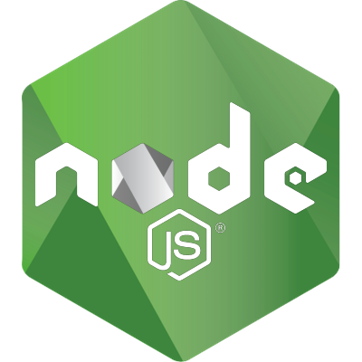

<!-- Reference:
https://github.com/othneildrew/Best-README-Template -->

<!-- PROJECT LOGO -->
 

  <h1><i>Decentralized Lottery Service</i></h1>

  
  
  .

  

    An ERC20 token on Ethereum mainnet !
  

 
 

<!-- TABLE OF CONTENTS -->

  
Table of Contents

  <ol>
    <li><a href="#about-the-project">About The Project</a></li>
    <li><a href="#built-with">Built With</a></li>
    <li><a href="#getting-started">Getting Started</a></li>
    <li><a href="#license-or-author">License or Author</a></li>
    <li><a href="#contact">Contact</a></li>
    <li><a href="#acknowledgments">Acknowledgments</a></li>
  </ol>

 

<!-- ABOUT THE PROJECT -->
## About The Project
- An ERC20-token created using openzeppelin's abstractions & deployed on the ethereum mainnet
- The token is intended to support multiple other use-cases & applications planned to be hosted on the ethereum maintain in the form of smart-contracts

  
(<a href="#readme-top">back to top</a>)

## Built With
  &nbsp; &nbsp; &nbsp; &nbsp;  &nbsp; &nbsp; &nbsp; &nbsp; &nbsp; &nbsp;  &nbsp; &nbsp; &nbsp; &nbsp; &nbsp; &nbsp;  &nbsp; &nbsp; &nbsp; &nbsp; &nbsp; &nbsp;  &nbsp; &nbsp; &nbsp; &nbsp; &nbsp; &nbsp; 

  &nbsp; &nbsp; &nbsp; &nbsp; &nbsp; &nbsp; <b><i> Solidity </i></b> &nbsp; &nbsp; &nbsp; &nbsp; &nbsp; &nbsp; &nbsp; &nbsp; &nbsp; <b><i> NodeJS </i></b> &nbsp; &nbsp; &nbsp; &nbsp; &nbsp; &nbsp; &nbsp; &nbsp; <b><i> Ethereum </i></b> &nbsp; &nbsp; &nbsp; &nbsp; &nbsp; &nbsp; &nbsp; &nbsp; &nbsp; <b><i> Remix </i></b> &nbsp; &nbsp; &nbsp; &nbsp; &nbsp; &nbsp; &nbsp; &nbsp; &nbsp; <b><i> JavaScript </i></b>

  
(<a href="#readme-top">back to top</a>)

<!-- GETTING STARTED -->
## Getting Started
  #### Prerequisites
  * Solidity
  * Ethereum Lightweight node
  * NodeJS
  * Dependencies (Configured in each application)
  * IDE - Remix (Preferred)
  * Minimum - 8GB RAM, Intel i5 CPU (or Equivalent)

  #### Setup & Use
  1. Zip the repo
  2. Go to Remix IDE & import the zip into a new workspace
  3. Go to contracts & compile the required contract
  4. Go to deploy section
  5. Test with Virtual Machine & test accounts in VM
  6. Connect ethereum wallet accounts to remix *(advised to use a separate wallet with small amount of ether)*
  7. Deploy to Ethereum mainnet and test
  8. Invite others to interact with the deployed contract (directly/indirectly)

  
(<a href="#readme-top">back to top</a>)

<!-- LICENSE -->
## License or Author
  * Uditya Laad

  
(<a href="#readme-top">back to top</a>)

<!-- CONTACT -->
## Contact
  <b>Uditya Laad</b> &nbsp; [@linkedin.com/in/uditya-laad-222680148](https://www.linkedin.com/in/uditya-laad-222680148/)
  
  &nbsp; &nbsp; &nbsp; &nbsp; &nbsp; &nbsp; &nbsp; &nbsp; &nbsp; &nbsp; &nbsp; [@github.com/udityalaad](https://github.com/udityalaad)
  
  &nbsp; &nbsp; &nbsp; &nbsp; &nbsp; &nbsp; &nbsp; &nbsp; &nbsp; &nbsp; &nbsp; udityalaad123@gmail.com

  <b>Project Link</b> &nbsp; [https://github.com/udityalaad/Erc20Token](https://github.com/udityalaad/Erc20Token)

  
(<a href="#readme-top">back to top</a>)

<!-- ACKNOWLEDGMENTS -->
## Acknowledgments
  * [Open Source Stack, Openzeppelin](https://www.openzeppelin.com/open-source-stack)
  * [Remix Resources](https://remix-project.org/?lang=en)
  * [github.com/othneildrew/Best-README-Template/](https://github.com/othneildrew/Best-README-Template)
  * [Ethereum Wallpaper, Calibraint](https://www.calibraint.com/blog/the-complete-guide-to-erc20-tokens)

  
(<a href="#readme-top">back to top</a>)

